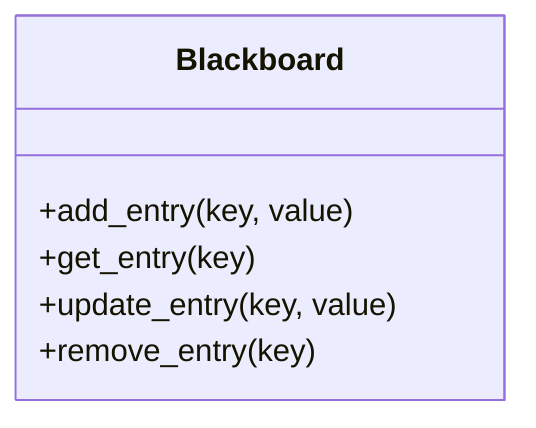
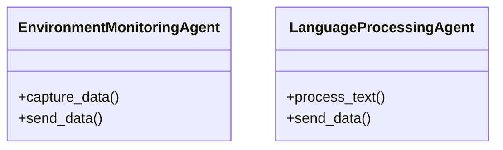
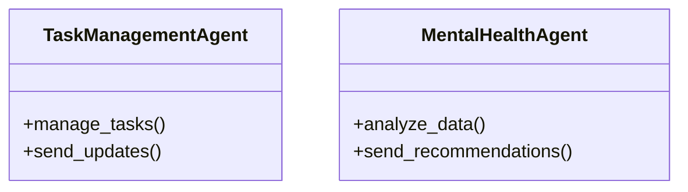
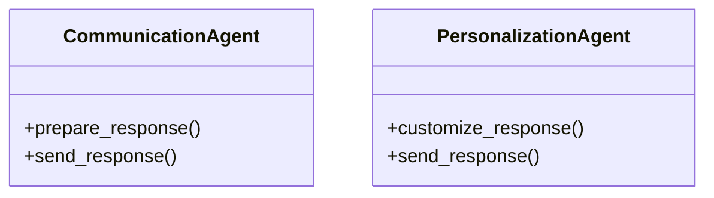
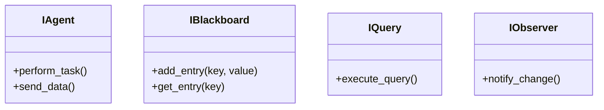
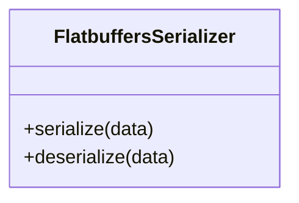
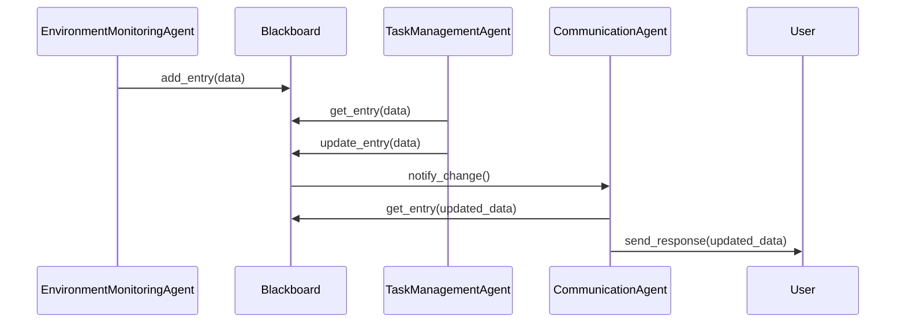

Here is the updated README.md with high-quality Mermaid diagrams to enhance the documentation.

```markdown
# Convergence Project

## Introduction
The Convergence project implements a Blackboard System to facilitate multi-agent collaboration. The system supports real-time data processing and decision-making through a shared knowledge base.

## Installation
Instructions for setting up the project environment and dependencies.

## Usage
Steps to run the application and example use cases.

## Components

### Blackboard System
The blackboard acts as the central shared database where agents can add, retrieve, and modify data.



### Agents

#### Input Layer
Agents in the input layer capture and process initial data inputs.



#### Processing Layer
Agents in the processing layer manage and analyze data.



#### Output Layer
Agents in the output layer prepare and send responses to users.



### Interfaces
Defines communication protocols between components.



### Serialization
Handles data serialization and deserialization.



### Overall System Architecture
The following diagram shows the overall architecture of the system, including interactions between agents and the blackboard.



## Contributing
Guidelines for contributing to the project.

## License
Project license information.
```

### Next Steps

With the updated documentation, we can now proceed to implement the components as defined previously. Let's start with the implementation of the Blackboard and the agents.